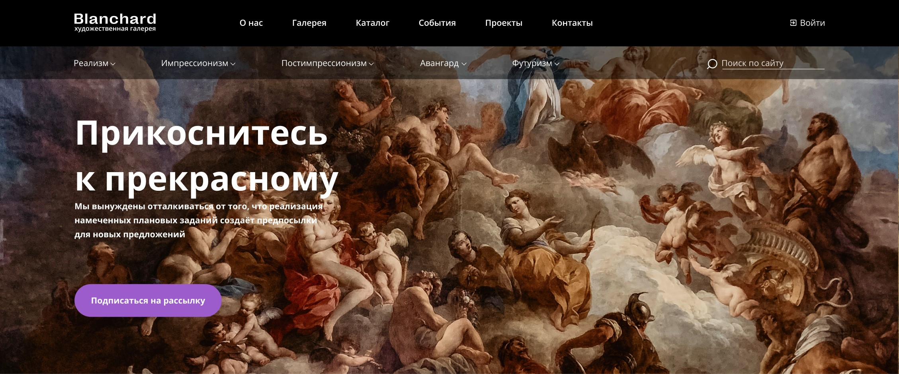

# Художественная галерея

## О проекте

Одностраничный сайт «Blanchard» - для художественной галереи 
["Макет"](https://www.figma.com/file/uJUg7Egs9v7hA4tAGTW7hc/Blanchard-(Copy)?type=design&mode=dev)

## Запуск
1. Склонируйте все содержимое репозитория `git clone <this repo>`
1. Откройте проект с помощью `«Open with Live Server»`

## Задачи

1. Вёрстка:
   - адаптивная (4 @media-запроса)
   - доступная
   - семантическая 
   - pixelPerfect (отклонения до 3px)
   - кроссбраузерная (браузеры: Chrome, Firefox, Safari, Opera, Edge)
     
   
     
1. Плавный юзабилити, работающий функционал:
   - бургер-меню
   - выпадающие списки
   - аккордеон
   - модальные окна
   - валидация форм
   - слайдеры
   - карта
   - подсказки
     
   

1. БЭМ-именование классов, соблюдение CodeStyle
1. Оптимизация процесса загрузки

## Инструментарий

1. HTML
1. CSS:
   - flex-box
   - animations
1. JS:
   - Vanilla JS
   - Libraries for:
      -  form-validator
      -  pop up elements
      -  accordion
      -  scroll
      -  slides
      -  map
1. GitLab
1. Figma
1. DevTools, NVDA, Validator, BrowserStack, Squoosh, HtmlTreeGenerator, typograf …

